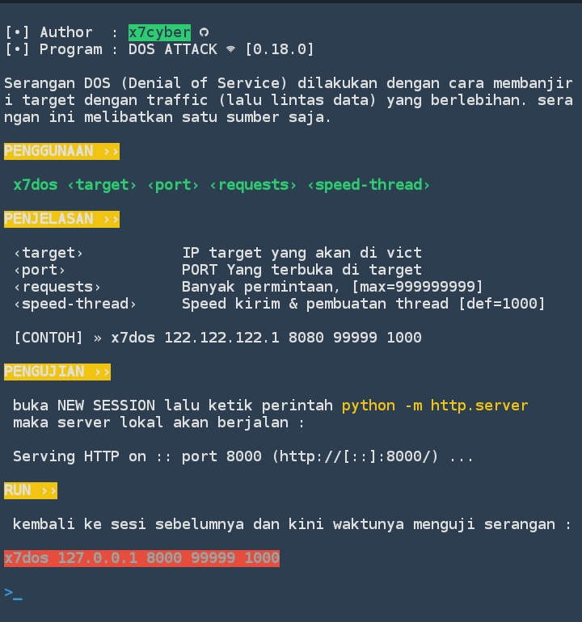

# x7dos 📡 🚥
X7DOS mengirimkan beberapa paket (lalu lintas data) yang tidak berguna secara berlebihan.
#

#
## Install 📦
```
git clone https://github.com/x7cyber/x7dos
```
```
cd x7dos
```
```
chmod +x start
```
### Run
```
./start
```
```
x7dos ‹target› ‹port› ‹req› ‹speed-thread›
```
### Happy use & check your buffer 🙂
